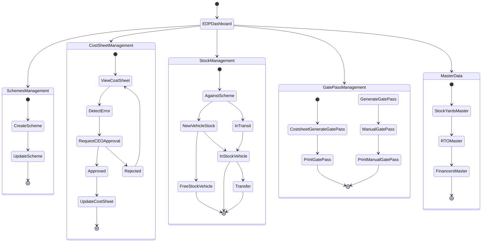

---
---

# EDP Managers

# Features

**Schemes Management**

Bulk import and update schemes

Edit individual schemes

Create new schemes individually

**Cost Sheet Management**

Cost sheet updates in case of errors (requires CEO approval)

**Vehicle & Stock Management**

Manage vehicle stock against schemes

Track free stock, in-stock, transit, and transferred vehicles

**Gate Pass Management**

Print gate pass and related documents
Manual gate pass generation for miscellaneous purposes

# Points to Remember

OEM Discount = Mahindra accessories schemes and mahindra cash scheme. 

Ex-showroom amount = Basic Price + Charge Price.

Vehicle data cannot be entered unless scheme data is available.

Model Code in schemes must match the Model Code of the imported stock data.

Vehicles cannot be imported without schemes.

Model Code and Model Type must match and are both unique for in-stock vehicles.

## Stock Status Definitions

**FREE STOCK**

Vehicles freed by SM with OTF in free stock.

Vehicles without OTF.

OTF is null, but a booking form has been created from free stock.

**IN-STOCK**

Vehicles that have an OTF and are available in EDP in-stock.

**PROCESSING**

Vehicles for which HOTO has been initiated.

**TRANSIT**

Vehicles that have not yet reached the stockyard.

Vehicles may or may not have an OTF number.

**TRANSFERRED**

Vehicles transferred to another dealership.

**SOLD**

Vehicles for which all processes are completed and a gate pass has been generated.

**FREE VEHICLES**

Vehicles freed by SM from their stock.

EDP can remove these vehicles from the free stock list using UPDATE.

Vehicles can be sent back to SM using REMOVE FROM F-S.

# Cost Sheet

These are cost sheets where the vehicle has been successfully processed and only final documents remain, such as Gate Pass, Form 21, etc.

**View Cost Sheet**

Vehicles where HOTO has been initiated.

EDP can view these cost sheets.

Any modification requires CEO approval.

## Master Data

**Stockyard**

Add new stockyards to the system.

These will appear in the stockyard location dropdown.

**RTO**

Add new RTO locations along with RTO numbers.

Helps SM during vehicle registration in the cost sheet.

**Finance**

Add new financiers if a customer requests a loan from a new financer.

These names will appear in Costsheet → Finance → Financer dropdown.

**Bank Account**

Add new bank accounts with account numbers.

These will be visible to all cashiers.

**Schemes**

Scheme data must be imported into the system.

Updating schemes is mandatory whenever there is a change.

Schemes can be created individually or imported in bulk.

Schemes can be edited manually for specific vehicles if required.

Schemes can be exported and updated in bulk using the export feature.

Schemes can be searched using Model Code, Segment, and Model Group.

**Gate Pass**

Manual gate passes can be created through the system; the vehicle will then reflect under Sold Vehicles.

All manually generated gate pass data can be exported at once using the Export button.