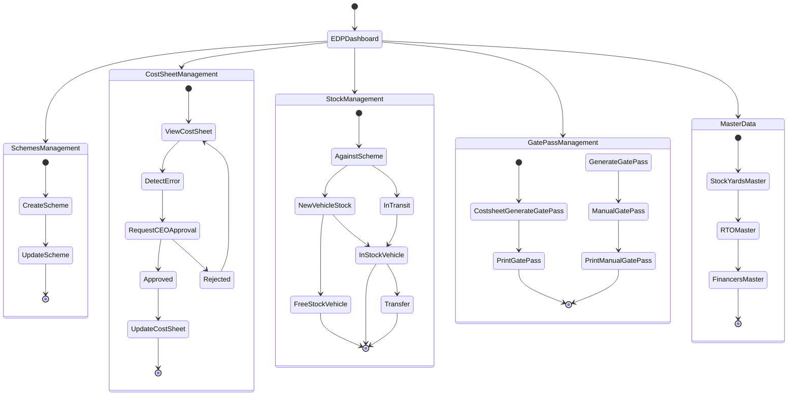

---
---

# EDP Managers

```mermaid
stateDiagram-v2
  [*] --> EDPDashboard

  %% Dashboard Navigation
  EDPDashboard --> SchemesManagement
  EDPDashboard --> CostSheetManagement
  EDPDashboard --> StockManagement
  EDPDashboard --> GatePassManagement
  EDPDashboard --> MasterData

  %% Schemes Management
  state SchemesManagement {
    [*] --> CreateScheme
    CreateScheme --> UpdateScheme
    UpdateScheme --> [*]
  }

  %% Cost Sheet Management
  state CostSheetManagement {
    [*] --> ViewCostSheet
    ViewCostSheet --> DetectError
    DetectError --> RequestCEOApproval
    RequestCEOApproval --> Approved
    RequestCEOApproval --> Rejected
    Approved --> UpdateCostSheet
    UpdateCostSheet --> [*]
    Rejected --> ViewCostSheet
  }

  %% Stock Management
  state StockManagement {
    [*] --> AgainstScheme
    AgainstScheme --> NewVehicleStock
    AgainstScheme --> InTransit
    NewVehicleStock --> FreeStockVehicle
    FreeStockVehicle --> [*]
    NewVehicleStock --> InStockVehicle
    InStockVehicle--> [*]
    InTransit --> InStockVehicle
    InStockVehicle --> Transfer
    Transfer --> [*]
  }

  %% Gate Pass Management
  state GatePassManagement {
    [*] --> CostsheetGenerateGatePass
    CostsheetGenerateGatePass --> PrintGatePass
    PrintGatePass --> [*]

    GenerateGatePass --> ManualGatePass
    ManualGatePass --> PrintManualGatePass
    PrintManualGatePass --> [*]
  }

  %% Master Data Management
  state MasterData {
    [*] --> StockYardsMaster
    StockYardsMaster --> RTOMaster
    RTOMaster  --> FinancersMaster
    FinancersMaster --> [*]

  }


```
