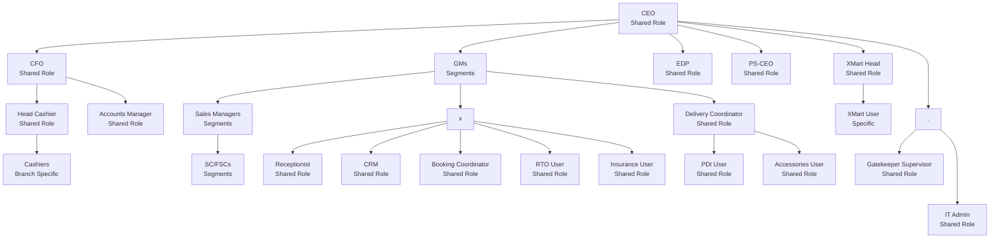

# DealerSetu SOP - Introduction

Welcome to the DealerSetu Standard Operating Procedure (SOP) documentation.

This documentation provides comprehensive guidance on how to use and operate the DealerSetu system.

## Overview

DealerSetu is a workflow automation system designed to streamline business processes and improve efficiency.



## Documentation Structure

This documentation is organized into the following sections:

- **User Management** - Guides for managing users, including onboarding new users
- Additional sections will be added as documentation is completed

- **Updating User Details** - Guides for managing users, including onboarding new users
- Additional sections will be added as documentation is completed

## Getting Started

To get started with DealerSetu, please follow the sections in this documentation in order.

```

```
