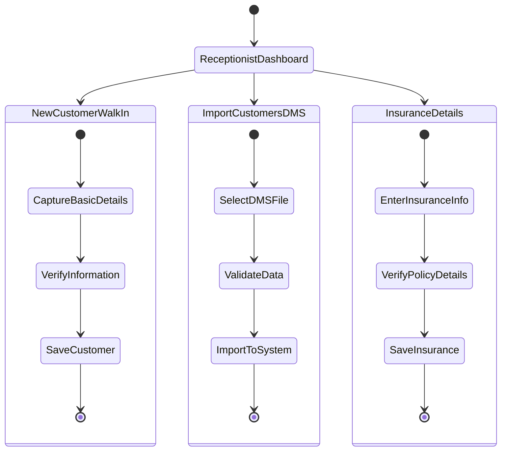

---
---
# Receptionist

# Features

**Create New Coustomer**

  It is mandatory to enter complete customer details in the system to ensure proper tracking of all walk-in enquiries.
  This includes enquiry number, preferred variant, and other related information, allowing all data to be managed from a single place.

**Editing Existing Coustomer**
  Receptionists can search for a specific enquiry number.
  If any customer details are missing or incorrect, they can be updated directly through the system.

**Importing Coustomers**
  Customers can be imported directly from the DMS, reducing manual data entry and ensuring data accuracy.

**See Insurance Data**
  Reception can view customer insurance-related data within DealerSetu, ensuring easy access and better coordination.