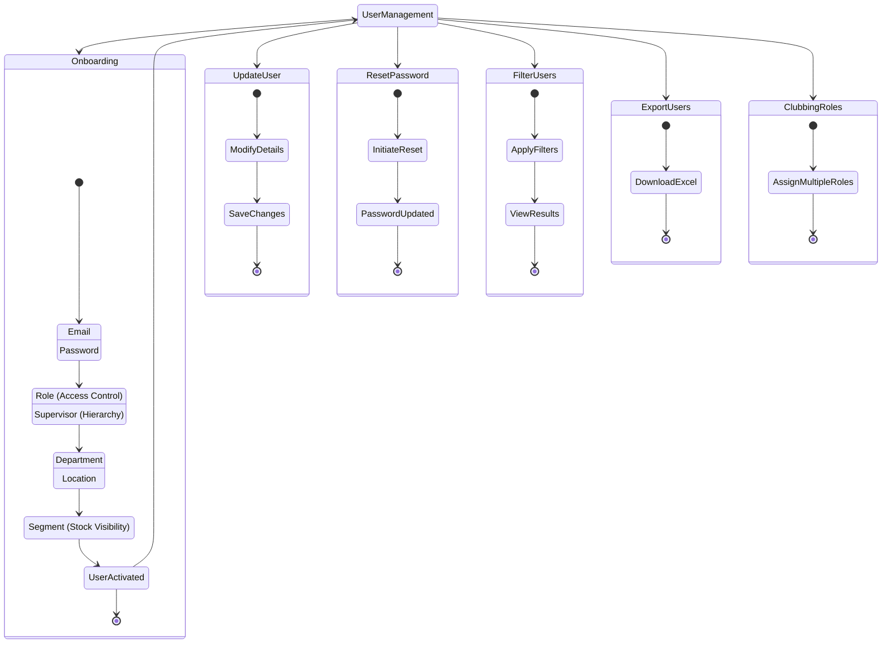

# User Management

User Management in DealerSetu provides comprehensive tools for managing users, their access, roles, and organizational context.

## Overview

The User Management system allows administrators to:

- **Onboard new users** - Complete user setup with access, roles, and business context
- **Update user details** - Modify user information and settings
- **Reset passwords** - Manage user authentication credentials
- **Filter users** - Search and filter users based on various criteria
- **Export users** - Download user data in Excel format
- **Club roles** - Assign multiple roles to users for flexible access control

## User Management Workflow

The following diagram illustrates the complete User Management workflow and all its sub-processes:

## Features

### Onboarding New Users

The onboarding process includes:

- **Basic Details**: Email and password setup
- **Access Details**: Role assignment and supervisor hierarchy
- **Organization Details**: Department and location assignment
- **Business Context**: Segment assignment for stock visibility

[Learn more about onboarding new users →](./onboarding-new-users)

### Update User

Modify user details and settings as needed.

### Reset Password

Manage user authentication by resetting passwords.

### Filter Users

Search and filter users based on various criteria to find specific users quickly.

### Export Users

Download user data in Excel format for reporting and analysis.

### Clubbing Roles

Assign multiple roles to users for flexible access control and permissions management.
